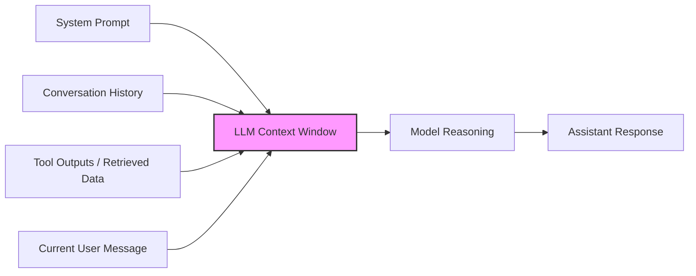
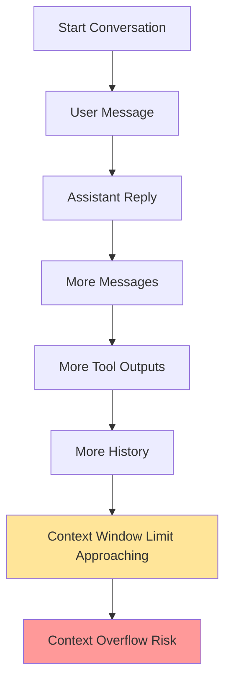
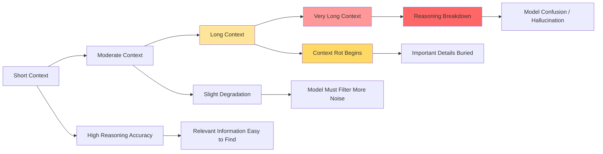
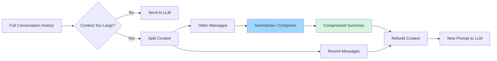
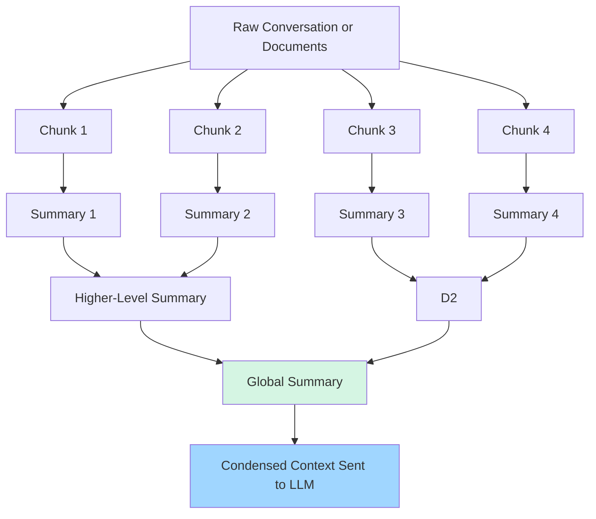
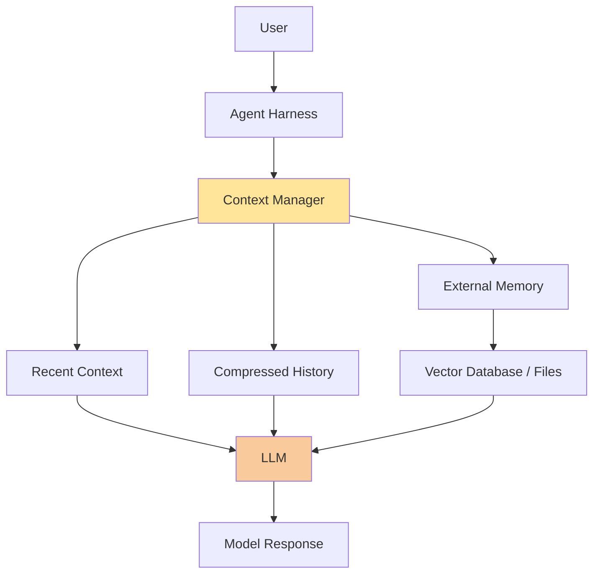

# LLM Context Compression in Agent Harnesses

## Overview

Large Language Model (LLM) agents operate within a **finite context window**.  
This window contains everything the model can “see” when generating a response.

Typical context includes:

- System instructions
- Conversation history
- Tool outputs
- Retrieved documents
- Current user request

The problem is simple:

> Agent workflows generate tokens faster than the context window can hold.

As agents perform tasks over many steps, their working memory grows until it eventually exceeds the model’s capacity.

To solve this, agent frameworks implement **context compression** (also called **compaction**).

Context compression reduces the size of historical context while preserving the **essential information required for reasoning**.

---

# The Context Window

The context window acts like the model's **working memory**.

Everything the model reasons about must fit inside this space.



When the context window becomes too large, the system must either:

- discard information
- compress information
- retrieve information on demand

---

# The Context Growth Problem

Agent workflows naturally accumulate information:

- tool outputs
- observations
- intermediate reasoning
- task results

Without intervention, this eventually exceeds the context window.



This is why **context management becomes essential for long-running agents**.

---

# Context Rot

Even before the context window fills completely, reasoning quality can degrade.

As the context grows:

- important information becomes buried
- irrelevant tokens increase
- model attention becomes diluted

This phenomenon is commonly referred to as **context rot**.



Because of this, simply increasing context windows does **not fully solve long-horizon reasoning problems.

Agent frameworks must actively manage memory.**

---

# The Context Compression Pipeline

Most agent harnesses perform compression using summarization and pruning.

A typical pipeline looks like this:



The key idea:

```
recent context remains unchanged
older context is compressed
```

The compressed summary replaces the original messages.

---

# Hierarchical Summarization

More advanced systems use **hierarchical summarization**.

Instead of compressing everything at once, the system creates summaries in layers.

Older data becomes progressively more condensed.



This approach allows agents to maintain **extremely long effective memory** while still operating within limited context windows.

---

# Agent Memory Architecture

Modern agent systems usually combine multiple memory layers.



Typical memory hierarchy:

```
recent messages
compressed summaries
external memory (RAG / databases / files)
```

This architecture allows agents to run **long multi-step workflows without exceeding the context window**.

---

# Tradeoffs of Context Compression

Compression provides major benefits but introduces tradeoffs.

### Advantages

- Enables long-running agent sessions
- Reduces token usage
- Faster inference
- Lower compute cost

### Disadvantages

- Loss of detail
- Possible summary drift
- Harder debugging
- Risk of missing important information

---

# Conclusion

Context compression is a foundational capability of modern AI agents.

By intelligently summarizing and managing historical context, agents can maintain continuity across long workflows while operating within finite context windows.

However, compression must be carefully designed to balance:

```
information fidelity
vs
context efficiency
```

Understanding this tradeoff is central to building reliable AI agent systems.

---
